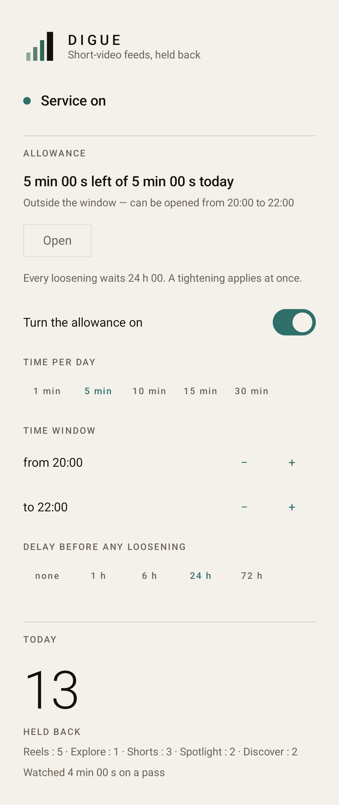
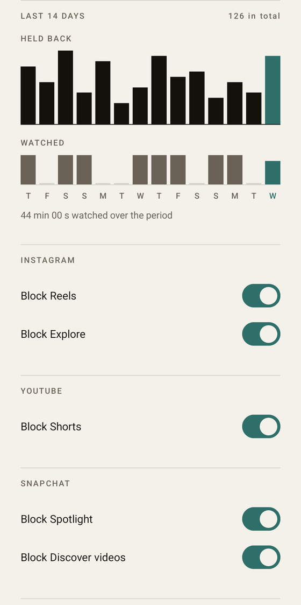

<p align="center">
  
</p>

<h1 align="center">Digue</h1>

<p align="center"><em>Short-video feeds, held back</em></p>

<p align="center">
  <a href="README.md">Français</a> · <strong>English</strong>
</p>

<p align="center">
  
  
  
  
  
</p>

---

An Android app that **blocks short-video feeds inside several official apps**.

It is not an alternative client: none of those apps exposes a feed API. Digue watches their
view tree through an `AccessibilityService`, recognises the screen on display, and acts —
stepping back out most of the time, or pressing one precise node in the case of Explore.

The mark says the same thing in four rectangles: three waves rising, and a sea wall that does
not move. *Digue* is French for that wall.

## Five surfaces, five switches

| App | Surface | What recognises it |
|---|---|---|
| Instagram | Reels | the `clips_tab` tab, and the `clips_viewer_view_pager` player |
| Instagram | Explore | the `search_tab` tab — **redirects** to search instead of leaving |
| YouTube | Shorts | the `reel_player_page_container` container |
| Snapchat | Spotlight | `spotlight_container`, or the heart on the right-hand rail |
| Snapchat | Discover | the vertical action column, or the subscribe button |

Every switch is independent, and **new surfaces arrive switched off**.

## What it looks like

The single screen, whole, split in two at a section hairline.

<p align="center">
  
  
</p>

> Demonstration figures, written into the database by hand before the shot. No real usage data
> appears anywhere in this repository.

The interface is in **French and English**. French is picked automatically on a French phone,
English everywhere else, and Android 13+ lets the app's language be changed without touching
the system's.

## The allowance, and why it is slow

Blocking with no way round does not hold: sooner or later everything gets switched off. So
Digue grants a few minutes a day, **openable only inside a chosen time window**, and makes
every loosening slow.

- **A tightening applies at once. A loosening waits the delay in force.** Cutting the
  allowance, shortening the window, turning the allowance off: immediate. The reverse:
  deferred, and shown on screen while it waits.
- **The delay charged is the one in force, never the one being proposed.** Otherwise setting
  the delay to zero would unlock everything on the spot.
- **Time is counted on the wall clock from an explicit unlock**, not as screen time actually
  spent. Counting screen time would let the counter be paused by leaving the app for three
  seconds.
- **A tightening also cancels any pending change**, without which a loosening still armed
  would undo the tightening later, silently.

The lock protects Digue's *own* settings and nothing else — see "Known limits".

## What the app does not do, by construction

- **No network call, no network dependency.** Nothing ever leaves the device. No telemetry, no
  downloaded font, no rules fetched at runtime.
- **A view's `text` field is never read, never logged, never persisted.** An accessibility
  service sees every piece of text on screen; this one reads only the resource identifier, the
  accessibility description, the class name, the selected state, clickability and bounds.
- **The service only sees apps with a surface switched on.** The package list is redeclared at
  runtime from the settings, and it is enforced by Android rather than by the app: with
  Snapchat off, Snapchat is *unable* to reach the service.
- **No account, and no permission beyond accessibility.**

## Three fine behaviours, kept on purpose

1. **A reel someone sends you in a message stays watchable** — it carries a reply bar; the
   suggested reels that follow do not, and are blocked.
2. **Opening the Explore tab presses the search bar** instead of leaving the tab, because
   blocking Explore also blocked Instagram's only search.
3. **A friend's story on Snapchat stays watchable**, Discover videos do not. You subscribe to a
   publisher, never to a friend: that is what separates the two.

## Privacy, and what must never be committed here

**A privacy incident has already happened**, and it is the reason for the rule below: view-tree
captures holding contact names and excerpts of private conversations were committed once, then
purged and the history rewritten.

> **Never commit a screenshot or a raw view-tree capture**, from any of the three apps. A tree
> capture carries real personal data in its `contentDescription` fields, even though the app
> never reads the `text` field.

The test fixtures committed here are scrubbed — every `contentDescription` reads `[scrubbed]`,
apart from seven Instagram chrome strings that hold no personal content — and a test checks it
on every run, so that a fixture added carelessly is caught before it lands.

The repository was also private until 2026-08-18: earlier commits carried the test phone's
serial number. The history was rewritten and the remote recreated, so that no object of the old
history survives server-side.

## Building and testing

```bash
./gradlew build                                   # everything, lint included
./gradlew :detection:test :app:testDebugUnitTest  # 283 JVM tests
./gradlew :app:installDebug                       # installs on a connected device
./gradlew :app:connectedDebugAndroidTest          # 30 instrumented tests — UNINSTALLS the app
```

That last command wipes the app's database on its way out: back it up first if the device
carries a history that matters.

Turning the service on takes a gesture the app is not allowed to make for you — the "Open
accessibility settings" button leads there.

## Structure

```
:detection   Pure Kotlin, NO android.* import at all — the structural constraint.
             Screen recognition, rules, and the rule-file parser.
:app         The accessibility service, the database, the settings, the single Compose screen.
```

The service translates the Android tree into a neutral snapshot, then calls a pure function.
That is what makes detection testable on the JVM against real captured trees, with no device.

The rules live in `app/src/main/assets/rules.json`, in three confidence tiers — resource
identifier, accessibility description, position in the bottom bar — and a file dropped in
`filesDir` overrides them, which allows a broken detection to be repaired on the phone without
recompiling.

## Where the real documentation is

**[`CLAUDE.md`](CLAUDE.md)** — architecture, invariants, rule format, identifier traps, the
mechanics of the allowance and the lock, the device recipe, and the limits knowingly accepted.
It is in French. Read it before picking this up: every trap in it cost a real mistake, and the
file is kept current.

`docs/` holds the specifications and implementation plans, plus the audit of 2026-08-17 and the
two corrections that had to be undone from it.

## Known limits

- An accessibility service **cannot cancel a gesture**. After a swipe, about a second of the
  next piece of content stays visible before the app reacts. Irreducible.
- The lock protects Digue's *own* settings, nothing else. Turning the service off in the
  Android settings is still one gesture away, and so is uninstalling. A password was ruled out
  for exactly that reason: a secret you choose yourself is worth nothing against yourself,
  whereas a delay holds even when you know the whole codebase.
- The rules rest on internal resource identifiers. The day one of those apps renames one, the
  surface concerned stops being blocked; the app says so by reporting degraded detection, but
  repairing it takes a fresh capture.
- **One test device only**, a Pixel 9a. The geometric heuristics have never been tried on
  another screen size.

## Licence

MIT — see [`LICENSE`](LICENSE).
