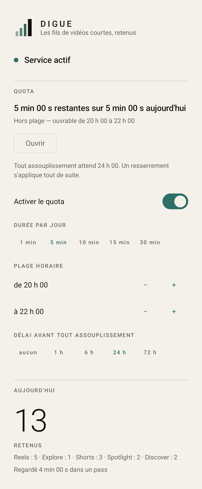
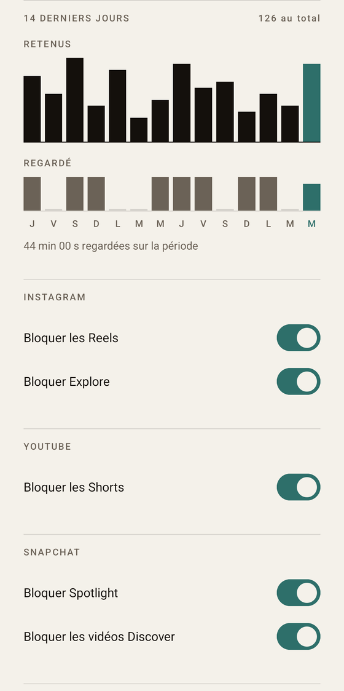

<p align="center">
  
</p>

<h1 align="center">Digue</h1>

<p align="center"><em>Les fils de vidéos courtes, retenus</em></p>

<p align="center">
  <strong>Français</strong> · <a href="README.en.md">English</a>
</p>

<p align="center">
  
  
  
  
  
</p>

---

App Android qui **bloque les fils de vidéos courtes dans plusieurs apps officielles**.

Ce n'est pas un client alternatif : aucune de ces apps n'expose d'API de fil. Digue observe
leur arbre de vues via un `AccessibilityService`, reconnaît l'écran affiché, et agit — retour
arrière la plupart du temps, ou un appui sur un nœud précis pour Explore.

La marque dit la même chose en quatre rectangles : trois vagues qui montent, une digue qui ne
bouge pas.

## Cinq surfaces, cinq interrupteurs

| App | Surface | Ce qui la reconnaît |
|---|---|---|
| Instagram | Reels | l'onglet `clips_tab`, et le lecteur `clips_viewer_view_pager` |
| Instagram | Explore | l'onglet `search_tab` — **redirige** vers la recherche au lieu de sortir |
| YouTube | Shorts | le conteneur `reel_player_page_container` |
| Snapchat | Spotlight | `spotlight_container`, ou le cœur du rail droit |
| Snapchat | Discover | la colonne d'actions verticale, ou le bouton d'abonnement |

Chaque interrupteur est indépendant, et **les surfaces nouvelles arrivent éteintes**.

## À quoi ça ressemble

L'écran unique, en entier, coupé en deux à un filet de section.

<p align="center">
  
  
</p>

> Chiffres de démonstration, écrits à la main dans la base avant la prise de vue. Aucune donnée
> d'usage réelle ne figure dans ce dépôt.

L'interface est en **français et en anglais**. Le français est choisi automatiquement sur un
téléphone en français, l'anglais partout ailleurs, et Android 13+ laisse changer la langue de
l'app seule sans toucher à celle du système.

## Le quota, et pourquoi il est lent

Bloquer sans exception ne tient pas : on finit par tout éteindre. Digue accorde donc quelques
minutes par jour, **ouvrables seulement dans une plage horaire choisie**, et rend tout
assouplissement lent.

- **Un resserrement s'applique tout de suite. Un assouplissement attend le délai en vigueur.**
  Réduire le quota, raccourcir la plage, éteindre le quota : immédiat. L'inverse : différé, et
  visible à l'écran pendant l'attente.
- **Le délai facturé est celui en vigueur, jamais celui qu'on propose.** Sinon il suffirait de
  mettre le délai à zéro pour tout débloquer sur-le-champ.
- **Le temps se compte à l'horloge murale depuis un déblocage explicite**, pas en temps d'écran.
  Compter l'écran permettrait de mettre le compteur en pause en quittant l'app trois secondes.
- **Un resserrement annule aussi tout changement en attente**, sans quoi l'assouplissement
  encore armé déferait le resserrement plus tard, en silence.

Le verrou protège les réglages *de Digue*, et rien d'autre — voir « Limites connues ».

## Ce que l'app ne fait pas, par construction

- **Aucun appel réseau, aucune dépendance réseau.** Rien ne quitte l'appareil, jamais. Pas de
  télémétrie, pas de police téléchargée, pas de règles récupérées à l'exécution.
- **Le champ `text` des vues n'est jamais lu, ni journalisé, ni persisté.** Un service
  d'accessibilité voit tout le texte à l'écran ; celui-ci ne lit que l'identifiant de
  ressource, la description d'accessibilité, la classe, l'état sélectionné, la cliquabilité
  et les bornes.
- **Le service ne voit que les applications dont une surface est allumée.** La liste des
  paquets est redéclarée à l'exécution depuis les réglages, et elle est appliquée par Android,
  pas par l'app : Snapchat éteint, Snapchat est *incapable* d'atteindre le service.
- **Aucun compte, aucune permission au-delà de l'accessibilité.**

## Trois comportements fins, tenus exprès

1. **Un reel qu'un contact envoie en message reste regardable** — il porte une barre de
   réponse ; les reels suggérés qui suivent ne l'ont pas et sont bloqués.
2. **Ouvrir l'onglet Explore appuie sur la barre de recherche** au lieu de sortir de l'onglet,
   parce que bloquer Explore bloquait aussi la seule recherche d'Instagram.
3. **Une story d'ami sur Snapchat reste regardable**, les vidéos Discover non. On s'abonne à un
   publieur, jamais à un ami : c'est ce qui sépare les deux.

## Vie privée, et ce qu'il ne faut jamais commiter ici

**Un incident de confidentialité a déjà eu lieu**, et c'est la raison de la règle qui suit :
des captures d'arbres de vues contenant des noms de contacts et des extraits de conversations
privées ont été commitées, puis purgées et l'historique réécrit.

> **Ne jamais commiter de capture d'écran ni de capture d'arbre brute**, d'aucune des trois
> apps. Une capture d'arbre porte de vraies données personnelles dans ses
> `contentDescription`, même si l'app ne lit jamais le champ `text`.

Les fixtures de test versionnées ici sont nettoyées — toutes leurs `contentDescription` valent
`[scrubbed]`, à l'exception de sept chaînes de chrome Instagram sans contenu personnel — et un
test le vérifie à chaque exécution, pour qu'une fixture ajoutée sans précaution soit attrapée
avant d'atterrir.

Le dépôt a par ailleurs été privé jusqu'au 2026-08-18 : les commits antérieurs portaient le
numéro de série du téléphone de test. L'historique a été réécrit et le dépôt distant recréé,
pour qu'aucun objet de l'ancienne histoire ne survive côté serveur.

## Construire et tester

```bash
./gradlew build                                   # tout, y compris le lint
./gradlew :detection:test :app:testDebugUnitTest  # 283 tests JVM
./gradlew :app:installDebug                       # installe sur un appareil branché
./gradlew :app:connectedDebugAndroidTest          # 24 tests instrumentés — DÉSINSTALLE l'app
```

La dernière commande efface la base de l'app en fin de course : sauvegarder avant si l'appareil
porte un historique qui compte.

Activer le service demande un geste que l'app n'a pas le droit de faire elle-même — le bouton
« Ouvrir les réglages d'accessibilité » y mène.

## Structure

```
:detection   Kotlin pur, AUCUN import android.* — c'est la contrainte structurante.
             Reconnaissance d'écran, règles, analyse du fichier de règles.
:app         Le service d'accessibilité, la base, les réglages, l'écran unique en Compose.
```

Le service traduit l'arbre Android en instantané neutre, puis appelle une fonction pure. C'est
ce qui rend la détection testable sur JVM contre de vrais arbres capturés, sans appareil.

Les règles vivent dans `app/src/main/assets/rules.json`, en trois paliers de confiance —
identifiant de ressource, description d'accessibilité, position dans la barre du bas — et un
fichier posé dans `filesDir` les surcharge, ce qui permet de réparer une détection sur le
téléphone sans recompiler.

## Où est la vraie documentation

**[`CLAUDE.md`](CLAUDE.md)** — architecture, invariants, format des règles, pièges
d'identifiants, mécanique du quota et du verrou, recette d'appareil, et les limites assumées.
À lire avant toute reprise : chaque piège qui y figure a coûté une erreur réelle, et le fichier
est tenu à jour.

`docs/` contient les spécifications et plans d'implémentation, plus l'audit du 2026-08-17 et
les deux corrections qu'il a fallu lui annuler.

## Limites connues

- Un service d'accessibilité **ne peut pas annuler un geste**. Après un glissement, environ une
  seconde du contenu suivant reste visible avant que l'app réagisse. Irréductible.
- Le verrou protège les réglages *de Digue*, rien d'autre. Couper le service dans les réglages
  Android reste à un geste, et désinstaller aussi. Un mot de passe a été écarté pour cette
  raison exacte : un secret qu'on choisit soi-même ne vaut rien contre soi-même, alors qu'un
  délai tient même en connaissant tout le code.
- Les règles reposent sur des identifiants de ressources internes. Le jour où une de ces apps
  en renomme un, la surface concernée cesse d'être bloquée ; l'app le signale en affichant une
  détection dégradée, mais la réparation demande une nouvelle capture.
- **Un seul appareil de test**, un Pixel 9a. Les heuristiques géométriques n'ont jamais été
  éprouvées sur une autre taille d'écran.

## Licence

MIT — voir [`LICENSE`](LICENSE).
